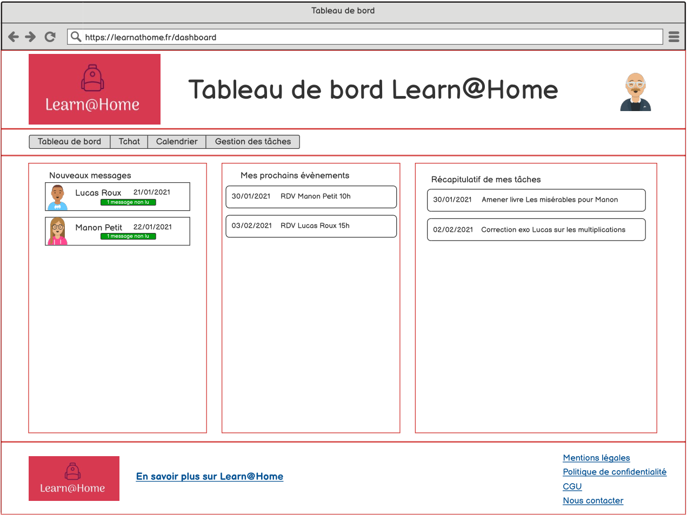

# Learn@Home

**_Projet réalisé lors de ma formation de Développeur d'application Python à OpenClassrooms_**

_**Learn@Home est une application de soutien scolaire à distance**_

_**Lors de ce projet, j'ai conçu un site web responsive avec le product backlog contenant:**_

1. Les Diagrammes de cas d'utilisation
2. Les User stories avec critères d'acceptation GIVEN-WHEN-THEN et SMART
3. Les Wireframes Desktop réalisés sous Balsamiq
4. Les Wireframes Mobile réalisés sous Balsamiq
5. Le Kanban sous Notion [Kanban Notion](https://www.notion.so/a8820ffde62343b38e1e665d0913c657?v=eeb516a33f5e4412bd394ae0d08eac3b)
